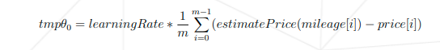
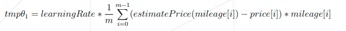
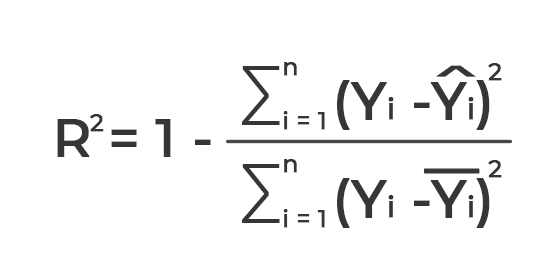
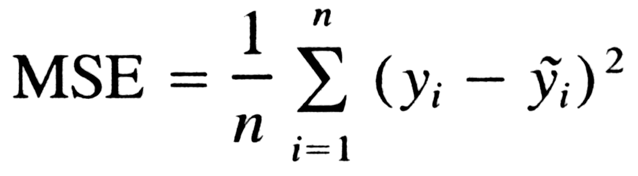
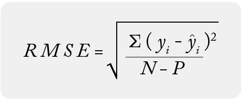
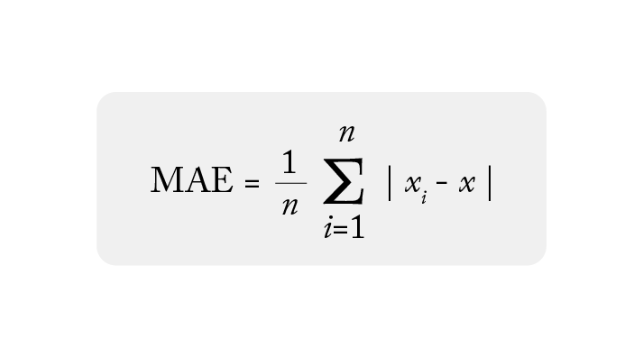
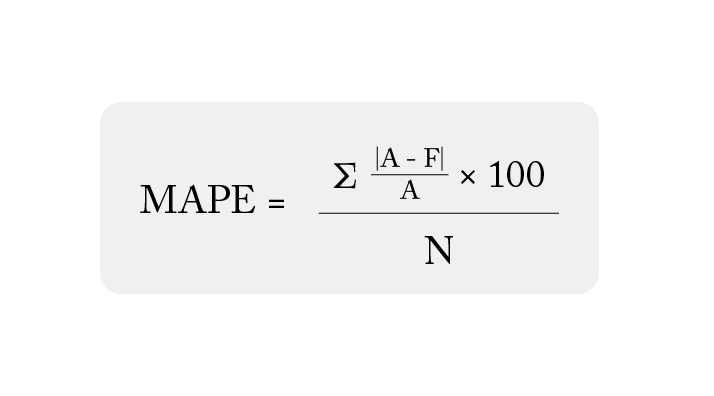

# ft_linear_regression
basic concept behind machine learning

## Overview

This project is an introduction to machine learning through the implementation of a linear regression algorithm using gradient descent.

The goal is to build a simple model capable of predicting the price of a car based on its mileage.


## How to Use

### Prerequierement
```bash
wget https://cdn.intra.42.fr/document/document/44051/data.csv
python3 -m venv .venv
source .venv/bin/activate
```

Train the model:
```bash
python3 ./train dataset.csv
```

Predict a price:
```bash
python3 ./predict
> enter a mileage
```

## Objective

implement a program that:

Learns from a dataset of car prices
Predicts the price of a car given its mileage

At the end of this project, we will understand:

- How linear regression works
- How gradient descent optimizes parameters
- How to train and use a simple machine learning model

## Concept


1. Data set:
    y: taget
    x: features
2. Model
    f(x) = ax + b
    
Where:

    - f(x) = y is the predicted value (dependent variable)
    - x is the input (independent variable)
    - m is the slope of the line (how much y changes when x changes)
    - b is the intercept (the value of y when x = 0)

3. Mean Squared Errror
    Residual = yᵢ−y^ᵢyᵢ− y^​ᵢ

Where:

    - yᵢ is the actual value 
    - y^​ᵢ is the predicted value from the line for that xᵢ
4. Interpretation of the Best-Fit Line
- Slope (m): The slope of the best-fit line indicates how much the dependent variable(y) changes with each unit change in the independent variable (x). For example if the slope is 5, it means that for every 1-unit increase in x, the value of y increases by 5 units.
- Intercept (b): The intercept represents the predicted value of y when x = 0. It’s the point where the line crosses the y-axis.

We use a simple linear model:

```
estimatePrice(mileage) = θ0 + (θ1 * mileage).
```
Where:
- ``θ0`` = intercept
- ``θ1`` = slope
- **mileage** = input feature
- estimatePrice = predicted output

## Project Structure

The project consists of two main programs:

1. Prediction Program
    - Takes a mileage as input
    - Outputs the estimated car price
    - Uses previously trained parameters (theta0, theta1)
2. Training Program
    - Reads a dataset (mileage vs price)
    - Trains the model using gradient descent
    - Saves the learned parameters for later use

## Training Algorithm

The parameters are updated using the following formulas:



Where:

``m`` = number of sample

``learningRate`` = step size controlling convergence

> [!WARNING]
> Important:

> Initialize theta0 = 0 and theta1 = 0
> Update both parameters simultaneously

## Constraints
- may use any programming language
- may use libraries only for assistance (visualization)
- Using libraries that directly compute regression is forbidden


## Bonus Features

(Optional, evaluated only if the mandatory part is perfect)

- Data visualization (scatter plot)
- Plotting the regression line
- Model accuracy evaluation

### Model accuracy evaluatioin

1. R² (Coefficient of determination) standard
Measures proportion of variance explained.



| advantage | disadvantage |
|:----:|:----:|
|intuitive interpretation (0 to 1), widely used in machine learning | does not indicate the average error in euros |

2. MSE / RMSE 
Root Mean Square Error. RMSE is in the unit of the data (€).




| advantage | disadvantage |
| :----: | :----: |
|physically interpretable| unbounded, sensitive to outliers |


3. MAE — Mean Absolute Error


| advantage | disadvantage |
|:----:|:----:|
|easy to understand and calculate| does not penalize large errors |

more MAE is small, best is the model

4. MAPE — Mean Absolute Percentage Error
the most meaningful for a business


| advantage | disadvantage |
|:----:|:----:|
| easy to read | problematic if prices are close to 0 |


## Reference 


- https://www.geeksforgeeks.org/machine-learning/ml-linear-regression/

graph:
- https://matplotlib.org/stable/api/_as_gen/matplotlib.pyplot.plot.html
- https://matplotlib.org/stable/gallery/pyplots/pyplot_simple.html

R square:
- https://www.datacamp.com/fr/tutorial/r-squared
- https://www.cashbee.fr/lexique/r-carre-ou-r2
- https://en.wikipedia.org/wiki/Coefficient_of_determination
- https://www.reddit.com/r/rstats/comments/igk7r7/how_do_i_check_the_accuracy_of_a_linear/?tl=fr

- https://www.jybaudot.fr/Stats/indicecarts.html


- https://ithy.com/article/evaluation-metrices-regression-mae-mse-rmse-r2-jqlx1zyp